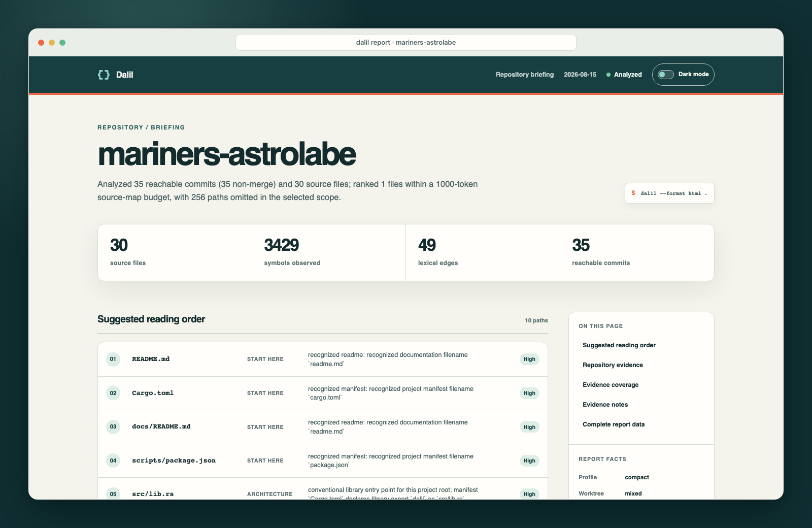
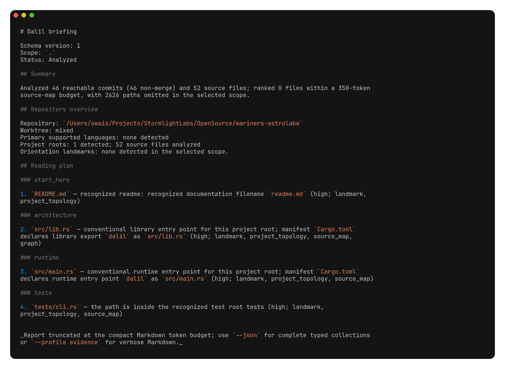

# Dalil

Dalil (Arabic for “guide”) is a CLI to help you orient yourself in a new
codebase.



It produces an integrated briefing, or a focused report when you need only one
evidence family:

- `dalil map` inventories the current worktree and extracts structural maps for
  Rust, JavaScript, JSX, TypeScript, TSX, Python, Ruby, Java, C#, Go, Lua, and Zig files.
- `dalil history` summarizes five Git-history signals
  1. churn
  2. contributors
  3. bug-related clusters
  4. monthly activity
  5. "firefighting"[^ff] language



## Quick start

Install the published crate with Cargo:

```sh
cargo install --locked dalil
```

To build an exact source checkout instead, use the committed lockfile:

```sh
cargo build --locked --release
```

Then run it from a Git worktree:

```sh
dalil
dalil --json
dalil --html > dalil-report.html
dalil --html --open
dalil map
dalil map --json
dalil map src --exclude 'src/generated/**' --json
dalil map --recursive --json
dalil history
dalil history contributors src --json
dalil explain src/map.rs --json
dalil explain Parser --focus Parser --json
dalil context --task 'fix parser cache invalidation' --changed-path src/map/cache.rs --teach --json
dalil context --task 'review the last change' --revision-range 'HEAD~1..HEAD' --json
dalil impact --revision-range 'HEAD~1..HEAD' --json
dalil capabilities --json
dalil doctor . --json
```

`PATH` defaults to the current directory. `dalil` discovers the enclosing
Git repository and keeps the selected scope inside that repository.

## Default briefing

`dalil [PATH]` starts with a repository overview and an ordered reading plan,
then includes up to five concise, evidence-backed history observations and brief
evidence notes. JSON retains the complete map and history report.

The source map accepts task, focus, token-budget, exclusion, cache, and color
controls:

```sh
dalil --task 'fix parser cache invalidation' --changed-path src/map/cache.rs .
dalil context --task 'review parser cache changes' --changed-path src/map/cache.rs --symbol CacheStore --json
dalil map --symbol parse_source --language rust --search cache --json
dalil --focus parser --focus-path src --budget 500 .
dalil --no-cache --json .
dalil --profile evidence --json .
```

`--task` derives local search terms from concise task text. Add `--symbol`,
`--task-path`, `--language`, `--project`, `--changed-path`, `--changed-symbol`,
or `--search` when you know relevant targets. JSON ranking entries show the
normalized task inputs, matched inputs, and each score contribution.

The report keeps history caveats, source-map limitations, query-pack provenance,
partial-file diagnostics, and omitted-path reasons beside the evidence they qualify.

This makes unsupported or partially parsed files actionable instead of silently dropping them.

The default `compact` profile returns selected snippets and bounded samples of
files, symbols, edges, findings, omissions, and history evidence.

JSON reports include each collection's observed total, returned count, truncation
state, and reason.

Use `--profile evidence` for a larger, still resource-limited evidence sample.
Generated, vendored, minified, and source-map paths remain excluded in both
profiles unless selected with an exact `--focus-path`.

`--budget` bounds a ranked selection of three to five strong source files and
the complete compact Markdown report. When fewer than three files fit or have
strong evidence, Dalil reports the shortfall instead of adding weak paths.
Compact Markdown keeps its summary and command-specific content first, then
prints a truncation notice when the remaining collections do not fit. JSON
retains the complete typed projection. Evidence-profile Markdown can exceed this
token budget and remains subject to the hard rendered-output limit.

## Commands

### `dalil map [OPTIONS] [PATH]`

The map command supports Rust, JavaScript, JSX, TypeScript, TSX, Python, Ruby, Java, C#, Go, Lua, and Zig source files.

An exact focus path can also include a classified `bin/` entry within the normal safety limits. It reports:

- tracked, modified, and untracked worktree state
- the selected language variant and file extension (`javascript_jsx` and `typescript_tsx` are explicit)
- definitions and lexical references with symbol kind, visibility, syntactic
  evidence, enclosing scope, 1-based source locations, and compact declaration context
- Go package and receiver scopes, import aliases, exported visibility, and `_test.go` declarations
- Lua local and global functions, dot and colon methods, variables, assignments, table fields, calls, and literal
  `require` module paths
- Zig containers, functions, variables, fields, test blocks, public declarations, calls, type uses, field access,
  and literal `@import` paths
- language- and import-aware lexical file edges with a resolution reason,
  confidence tier, candidate-group identity, and deterministic centrality ranking
- task-aware ranking from `--task`, symbols, paths, languages, project roots,
  changed paths or symbols, search terms, and optional `--focus` or
  `--focus-path` boosts
- repository landmarks for README and agent/contributor instructions, manifests and lockfiles,
  project roots, build/task entry points, test roots, CI, ownership, licenses, submodules, and
  nested repositories
- bounded manifest metadata for declared runtime entry points, library exports, and common build,
  test, and run commands; see [Manifest support](docs/manifests.md)
- monorepo project-root groups with bounded source recommendations
- a bounded ranked selection controlled by `--budget` (default: 1,000)
- parse errors, query-pack failures, grouped ambiguous lexical references, and
  unsupported/partial evidence per affected file
- non-source landmarks, configuration, documentation, and assets as `non_source`
  inventory omissions rather than unsupported programming-language evidence
- analyzed and omitted counts, repository root, scope, query-pack provenance, and
  supplied exclusions.

Lua & Zig module evidence is lexical.

Literal `@import("path.zig")` & `require("module.path")` calls can support file edges,
but in Lua, dynamic `require` arguments, metatable behavior, and runtime table mutation
are reported as limitations rather than resolved.

In Zig, comptime evaluation, inferred types, generic instantiation, error-union flow, and non-literal
imports are reported as limitations rather than resolved.

Exclusions can be repeated:

```sh
dalil map --exclude 'src/generated/**' --exclude 'tests/fixtures/**'
```

Map focus and cache controls are explicit:

```sh
dalil map --focus parser --focus-path src --budget 500
dalil map --cache always
dalil map --cache files --cache-file src/parser.rs
dalil map --cache manual
dalil map --no-cache
dalil map --recursive --no-cache
dalil cache path
dalil cache status
dalil cache prune
dalil cache clear
```

Profiles are selected with `--profile compact|evidence`. Compact is the default.

Nested repositories and checked-out submodules are boundaries by default. Use `--recursive` when
their source should be included; the boundary landmark remains in the report either way.

Compact analysis publishes these ceilings:

- 4,096 files
- 1 MiB per file
- 64 MiB of source bytes
- 2,048 syntax levels
- 20,000 symbols
- 32 lexical candidates per reference,
- 2,000 edges/findings
- 100,000 reachable commits
- 128 history evidence items per collection
- 30 seconds of analysis work,
- 8 MiB hard rendered-output limit.

Landmark output is capped at 64 compact landmarks and 32 compact project roots, with totals and
truncation metadata preserved in JSON. Evidence mode raises those caps to the published report
limits.

Dalil stores per-file records and a versioned repository index under
`$XDG_CACHE_HOME/dalil` (or `~/.cache/dalil`). The index records file
fingerprints, parser summaries, lexical edges, bounded history facts, and
repository metadata. It never writes to the repository. Use `--no-cache` to
bypass both reads and writes; `dalil cache status`, `prune`, and `clear` manage
the user-cache data.

### `dalil explain <PATH-OR-SYMBOL> [PATH]`

Explain turns a path or symbol into a reading decision. For each resolved path it
reports why to read it, confidence, ranking contributions and matched seeds,
lexical relationships, relevant keyword-matched commits, and any ambiguity,
omission, partial-source, or budget limitation that qualifies the advice.

It then suggests one distinct next read using the normal reading-plan selection
rules. When retained lexical edges connect a declared or conventional runtime
entry point to the target, it also shows that short route. The route is lexical
evidence, not proof of runtime control flow. Markdown and JSON carry the same
guidance.

### `dalil context [OPTIONS] [PATH]`

`context` compiles one task-shaped bundle from the normal source map and history
analysis. Its JSON result contains the normalized request, orientation,
recommended files and symbols, lexical relationships, relevant tests, history,
risks, uncertainty, provenance, omissions, and next reads. It does not embed
the raw map or history reports. Add `--teach` to request a short teaching
scaffold for an unfamiliar subsystem.

```sh
dalil context --task 'fix parser cache invalidation'
dalil context --task 'review cache changes' --changed-path src/map/cache.rs --symbol CacheStore --json
dalil context --task 'inspect local edits' --dirty-worktree --budget 750
```

Use the same task options as `dalil map`: `--symbol`, `--task-path`,
`--language`, `--project`, `--changed-path`, `--changed-symbol`, and `--search`.
`--base` and `--head` compare local revisions (an omitted endpoint defaults to
`HEAD`). `--revision-range` accepts one `base..head` range. `--dirty-worktree`
compares the local index with the worktree and includes untracked paths. The
bundle records added, deleted, modified, renamed, and untracked paths, plus
symbols whose source locations overlap changed lines when a supported parser
can inspect the current source.

Dalil resolves revisions through its embedded Git library. It does not call the
Git executable, hooks, filters, repository programs, or remotes. Unresolved
revisions, unsafe paths, parser gaps, missing objects, and bounded traversal are
reported as typed `change_resolution.uncertainty` entries in JSON.

`--teach` uses only files, symbols, lexical relationships, tests, and next
reads already selected for the bundle. Under a tight budget, it prioritizes a
runtime recommendation before generic orientation files. Each teaching step
records direct observations and labels its reading order as `inferred` or
`ambiguous`. Dalil omits a step when the selected evidence does not support it.

`--budget` applies to the bundle's selected evidence rather than fixed section
quotas. The result's `context.budget` describes the estimated token use and any
projection. If the scaffold cannot fit with the selected source evidence, it is
omitted and the budget is marked truncated.

### `dalil impact [OPTIONS] [PATH]`

`impact` uses the same local revision and dirty-worktree inputs as `context` to
prepare a bounded review list around a change:

```sh
dalil impact --revision-range 'HEAD~1..HEAD'
dalil impact --dirty-worktree --task 'review parser changes' --json
```

The report includes changed symbols, inspection targets, likely tests,
ownership configuration, and relevant path history under one budget. Every
relationship is labeled as lexical, structural, manifest, or history evidence
with a confidence tier. A relationship is evidence to inspect, not a claim that
one path definitively calls another or that the change will break code.

`impact` reads revisions through Dalil's embedded Git library. It never invokes
Git, hooks, filters, repository programs, or remotes.

### `dalil history [OPERATION] [OPTIONS] [PATH]`

History analysis uses committed Git data only. The available operations are:

```text
history                 all five signals
history churn           changed-path frequency
history contributors    author concentration
history bugs            fix-related path clusters and churn overlap
history activity        author-date commits grouped by month
history firefighting    revert, hotfix, emergency, and rollback language
```

The default history window is 365 days; recent contributor concentration uses 180 days.
Override the windows or keyword sets explicitly, for example:

```sh
dalil history bugs --window-days 30 --bug-keyword parser --json
dalil history bugs --keyword-match substring --json
dalil history contributors --include-emails --json
```

History output presents evidence and caveats. It does not treat churn, commit counts,
or commit-message matches as objective quality scores.

Bug and firefighting keywords use case-insensitive word-aware matching by default, and each
evidence commit records the terms it matched.

`--keyword-match substring` enables the former substring behavior explicitly.

Contributor concentration applies the `.mailmap` stored at the analyzed HEAD and records
raw-to-canonical identity mappings.

Compact output omits email addresses unless `--include-emails` is supplied.

Missing names are grouped as `Unknown`, and email matching is case-insensitive.

Churn keeps absolute commit counts and adds a rate per KiB using each path's current HEAD blob
size.

Empty, binary, generated, deleted, oversized, and resource-limited paths are labelled
explicitly.

Generated text is retained in normalization; empty, binary, deleted, oversized, and
resource-limited paths have no normalized rate.

Rename continuity is currently reported as unavailable, so exact-path counts never imply that earlier
history under another name was searched.

### `dalil capabilities --json` and `dalil doctor [PATH]`

`capabilities` reports the schema version, supported language grammars and query packs,
query-pack validity, and active compact/evidence.

`doctor` checks repository discovery, path-safety support, cache location and permissions,
the embedded schema, query packs, and effective limits.

## Output

Markdown is the default format. Use `--format json` or `--json` for machine-readable output:

```sh
dalil map --format json
dalil history --json
```

Use `--format html` or `--html` to write a standalone report for a browser:

```sh
dalil --html > dalil-report.html
dalil history --format html > dalil-history.html
```

Add `--open` to write the HTML report to a private temporary file and open it
in the default browser:

```sh
dalil --html --open
```

With Markdown or JSON, `--open` has no effect.

Reports go to stdout without ANSI escape sequences and diagnostics go to stderr.

Machine reports include typed provenance:

- the effective request and limits
- stable repository identity
- resolved HEAD reference/OID
- worktree state
- language/query-pack versions,
- cache state
- a UTC capture-date marker

History provenance records its observed committer-date range, author-versus-committer time
basis, current-HEAD semantics, and completeness status (`complete`, `shallow`, `missing_objects`, or `partial`).

The v1 JSON schema is [`schema/v1/dalil.json`](schema/v1/dalil.json), with compatibility
examples in [`schema/v1/golden`](schema/v1/golden), including a context bundle.

Diagnostic color can be controlled with `--color auto|always|never` or `--no-color`.

Color settings never change report stdout.

## Inspiration/References

1. [Aider's Repo Map](https://aider.chat/docs/repomap.html)
2. [codebase orient skill](https://github.com/DrCatHicks/learning-opportunities/tree/main/orient)
3. [The Git Commands I Run Before Reading Any Code](https://piechowski.io/post/git-commands-before-reading-code/)

[^ff]: https://newsroom.cisco.com/c/r/newsroom/en/us/a/y2024/m05/developers-spending-more-time-firefighting-issues-than-delivering-innovation.html
